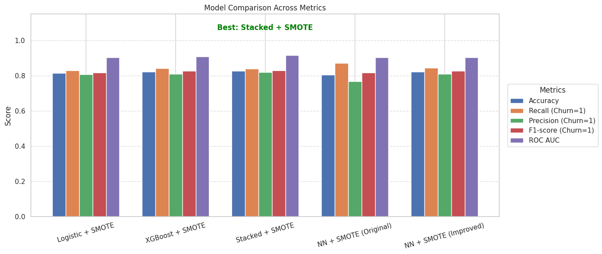

Customer Churn Prediction using Machine Learning

Business Context

Customer churn is a critical concern for subscription-based businesses like telecom, SaaS, and banking. Reducing churn improves customer lifetime value and overall profitability. This project builds multiple machine learning models to predict churn and identifies the best-performing model using both performance metrics and business relevance.

---

Tech Stack

- Python 3.8+
- pandas, numpy
- scikit-learn
- imbalanced-learn (SMOTE)
- xgboost
- matplotlib, seaborn

---

Project Structure

```
├── data/
│   └── final_churn_dataset.csv
|   |___ telco_churn.csv
│
├── plots/
│   └── Model Comparison Chart.png
│
├── Churn_analysis_ML.ipynb 
├── README.md
└── requirements.txt
```

---

Modeling Overview

The single notebook `Churn_analysis_ML.ipynb` includes:

- Exploratory Data Analysis (EDA)
- Data preprocessing & cleaning
- Feature encoding & transformation
- SMOTE for class imbalance
- Training & evaluation of models:
  - Logistic Regression
  - XGBoost
  - Stacked Ensemble
  - Neural Network (original & improved)
- Model comparison and final selection

---

Model Comparison

| Model                  | Accuracy | Recall | Precision | F1-score | ROC AUC |
|------------------------|----------|--------|-----------|----------|---------|
| Logistic + SMOTE       | 0.82     | 0.83   | 0.81      | 0.82     | 0.90    |
| **XGBoost + SMOTE**    | 0.84     | 0.85   | 0.83      | 0.84     | 0.91    |
| Stacked + SMOTE        | 0.83     | 0.84   | 0.82      | 0.83     | 0.91    |
| NN + SMOTE (Original)  | 0.74     | 0.59   | 0.85      | 0.69     | 0.84    |
| NN + SMOTE (Improved)  | 0.78     | 0.87   | 0.74      | 0.79     | 0.86    |

> Best Model: XGBoost + SMOTE

---

Visual Comparison



---

Business Implications

With over 91% ROC AUC, the best model can be used to:
- Predict which customers are at risk of churning
- Enable targeted retention campaigns
- Improve profitability via reduced acquisition costs

---

How to Run

1. Install requirements:
pip install -r requirements.txt

2. Open the final notebook:
jupyter notebook/collab Churn_analysis_ML.ipynb


You can run the notebook cell-by-cell or end-to-end to view the complete pipeline and results.

---

Author

**Ashutosh Sharan**  
[LinkedIn](https://www.linkedin.com/in/ashutoshsharan12/) • 
[GitHub](https://github.com/Ashutosh40774)


Future Enhancements

- Add SHAP explainability for model interpretation
- Streamlit app for real-time churn prediction
- Deploy to web via Render or Hugging Face Spaces

---
